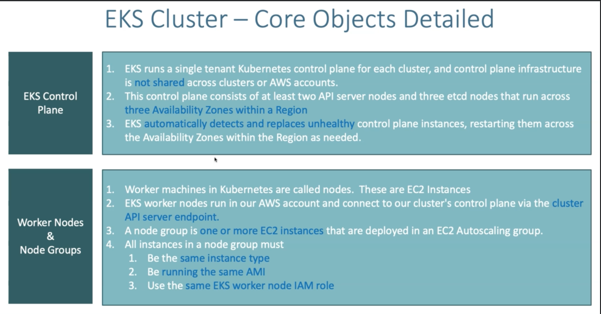
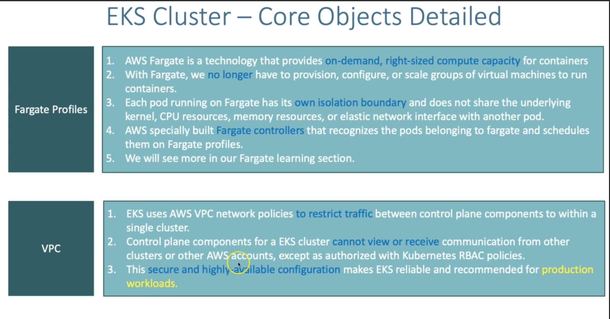

# AWS-EKS Tutorial

## This is a AWS-EKS tutorial with CloudFormation and Fargate

What we are building

### Create Cluster

eksctl create cluster --name=eksdemo1 \
                      --region=us-east-1 \
                      --zones=us-east-1a,us-east-1b \
                      --without-nodegroup

This will create the cluster without any nodegroup and nodes.

`kubectl get nodes` should not return any nodes  
`eksctl get clusters` should return the clusters list  
`eksctl get cluster --region=us-east-1` will give clusters in us-east-1 and respectively  

### Create & Associate IAM OIDC Provider for our EKS Cluster

This is necessary for IAM roles to be used for k8s service accounts  

`eksctl utils associate-iam-oidc-provider \
    --region us-east-1 \
    --cluster eksdemo1 \
    --approve`  

### Create EC2 Keypair

-- This keypair we will use it when creating the EKS NodeGroup.  
-- This will help us to login to the EKS Worker Nodes using Terminal.

### Create Node Group with additional Add-Ons in Public Subnets

- `eksctl create cluster --help` will give the options to create cluster and node groups
  
- similarly `eksctl create --help` gives all the options for creating different services

- similarly `eksctl create nodegroup --help` wil give lot of options on creating the nodegroup

- ADDONS will create IAM policies automatically for mentioned services

- Create Public Node Group
`eksctl create nodegroup --cluster=eksdemo1 \
                       --region=us-east-1 \
                       --name=eksdemo1-ng-public1 \
                       --node-type=t3.medium \
                       --nodes=2 \
                       --nodes-min=2 \
                       --nodes-max=4 \
                       --node-volume-size=20 \
                       --ssh-access \
                       --ssh-public-key={YourSecurityKeyPairName} \
                       --managed \
                       --asg-access \
                       --external-dns-access \
                       --full-ecr-access \
                       --appmesh-access \
                       --alb-ingress-access`

### Confirmation of Cluster

`
    # List EKS clusters
    eksctl get cluster

    # List NodeGroups in a cluster
    eksctl get nodegroup --cluster=<clusterName>

    # List Nodes in current kubernetes cluster
    kubectl get nodes -o wide

    # Our kubectl context should be automatically changed to new cluster
    kubectl config view --minify
`