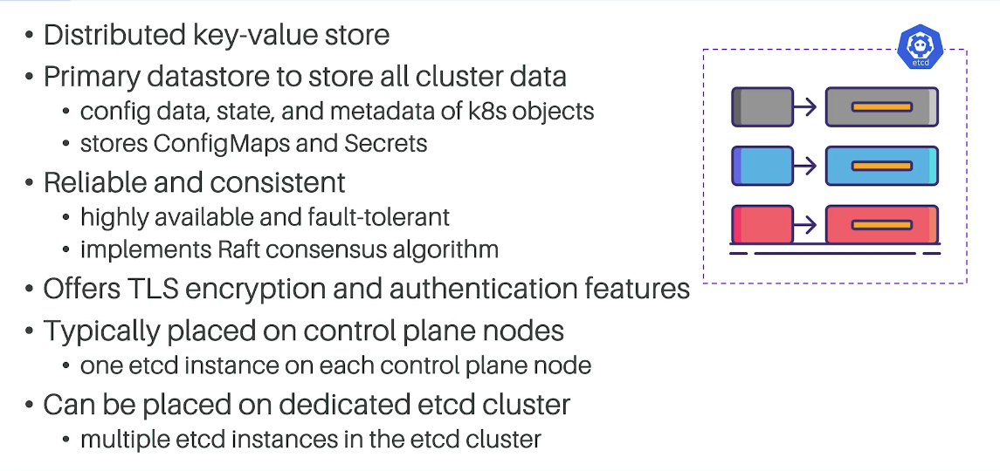

# KCNA Course notes

1. `docker run  -d -p 8888:80 -v /Users/muksollion/Downloads/workspace/Kubenetes/KCNA/static_website:/usr/share/nginx/html nginx:latest` for local to docker volume mapping,
2. `docker build -t kcna-app-nginx .` to build static website and push it to docker,
3. **Please check the running containers**,
4. **Please feel free to change the port from `8888` to whichever port suits your requirement**,
5. `docker ps` or `docker ps -a` - This should give you all containers those are running,  
6. You should be able to see the page in web browser by going to localhost:8888,
7. **Please check if the docker image exists** alternatively you can check the image is created by `docker images` command
8. `docker run -d --rm -p 8888:80 kcna-app-nginx` to run the dockerized container app,
9. This completes the local testing,

## K8s basics

1. `minikube start --nodes 3 --cni calico` - starts virual kubenetes cluster with 3 ndoes with container network interface called calico,
2. `minikube status` - checks the minikube status,
3. `kubectl cluster-info` - cluster braod information,
4. `kubectl explain pod` - to see what is POD and it's properties as a document (meta information),
5. `kubectl get nodes` - displays list of nodes with information,
6. `minikube delete` - **NOTE: this will remove all the exising the cluster content**,
7. `minikube stop` - stops the cluster,
8. `kubectl describe node/{node name for e.g. minikube OR minikube-m03 } | more` - to describe the condition of the minikube node,
9. `cat ~/.kube/config` - necesary information to connect to cluster,
10. `kubectl api-resources | more` - lists all the resources supported by cluster,
11. **namespace** provides the mechanism for isolating resources those are grouped in the current cluster,
12. `kubectl get namespaces` - shows namspace(s) list,

## Pods

1. `kubectl run nginxpod --image=nginx:latest` - to create a pod named as nginx,
2. `kubectl get pods -A` - to list all pods,
3. `kubectl get pods --namespace kube-system` or `kubectl get pods --n kube-system` - to list the pods in specified namespace,
4. `kubectl get pods -o wide` - shows more information about the pods in specified 'default' in this case,
5. CLI appraoch is called imperative way to create resources,
6. Declarative way to creating k8s resources is menifest files, Please refer **[this](./resources/pod.yml)** file for creating pods for e.g.,
   1. `kubectl apply -f resources/pod.yml` to apply the file,
   2. `kubectl get pods -o wide` to check the details of pod,
   3. `kubectl get po -o wide` OR `kubectl get pod -o wide` - they all work the same way,
   4. `kubectl delete -f resources/pod.yml` - also deletes the pod created from manifest file,
7. A Pod is the smallest and simplest Kubernetes object. It represents a single instance of a running process in your cluster,
8. Pods can run one or more containers, allowing them to run sidecar containers alongside the main application container due to their ability to specify multiple containers in the Pod's specification,
9. Pods can contain init containers, which run before app containers start, and sidecar containers, which run alongside app containers,
10. If a pod in a Job fails and "restartPolicy" is "OnFailure", Kubernetes retries the pod until it succeeds or reaches the backoff limit specified in the Job configuration,
11. Setting "maxUnavailable" to "0" in a RollingUpdate strategy ensures that no pods are made unavailable during the update process. This aims to maintain service availability by ensuring that at least the desired number of pods are always up and serving traffic. Remember that "maxUnavailable" and "maxSurge" cannot both be zero,

## API Server

## etcd

## Kube Scheduler

## Controlller manager

## Cloud Controller Manager

## Kube Proxy

## Kubelet

## Container Runtime Interface

## Kube Config

## Semantic Versioning (Semver)

## Kubernetes Resources

## imperative vs declarative

## Labels and Annotations

1. Labels are key-value pairs attached to resources that enable users to filter, select, and organize resources based on specified criteria,
2. Annotations allow you to attach additional, non-identifying information to your Kubernetes resources, whereas Labels are used to organize, select, and group resources,

## Replica Sets

1. `kubectl get replicasets` - display replica sets,
2. A ReplicaSet ensures that a specified number of pod replicas are running at any given time,
3. The `kubectl scale` command is used to adjust the number of replicas in a Deployment or ReplicaSet,

## Deployments

1. `kubectl apply -f resources/myapp-deployment.yml` - to run the replica sets deployment file,
2. `kubectl get deployments` - to display the deployments,
3. `kubectl get deployments -o wide` - to display the deployments,
4. `kubectl rollout history deployment/myapp-deployment` - to display rollout history,
5. `kubectl annotate deployment/myapp-deployment kubernetes.io/change-cause="first deployment"` - to annotate (tag) the deployment, (try rollout history after this to see the tagging),
6. `kubectl delete pod/{pod name}` - to delete the pod(s) separated by space,
7. `kubectl describe deployment/myapp-deployment | more` - to describe the deployment details,
8. `kubectl get deployment/myapp-deployment -o yaml` - to see the current configuration of the deployment,
9. `kubectl rollout undo deployment/myapp-deployment` - to undo the failed rollout deployment,
10. `kubectl rollout undo deployment/myapp-deployment --to-revision={revision number}` - to undo rollout to specific revision number,
11. `kubectl delete -f resources/myapp-deployment.yml` - to delete the deployment,
12. Valid update strategies for a Deployment are RollingUpdate and Recreate,
13. The `kubectl scale` command is used to adjust the number of replicas in a Deployment or ReplicaSet,
14. Deployments are typically used for stateless applications and support automated rolling updates to ensure zero downtime during updates,
15. The "maxSurge" property in a RollingUpdate strategy specifies the maximum number of pods that can be scheduled above the desired number of pods, allowing for a faster update process,

## Init and SideCar Containers

1. nit Containers are special containers that run before app containers are started in a Pod. They are used to run tasks such as setting up configuration, ensuring services are available, or performing any preliminary setup tasks required before the main app containers can run,
2. Sidecar Containers are used within Pods alongside the main app container to provide supporting features like logging, monitoring, networking, or data syncing without making changes to the app container itself,

## StatefulSet

1. `kubectl get services` - to get the list of services,
2. `kubectl get statefulsets` - to get the stateful sets,
3. `kubectl get endpoints` -  to get the endpoints of the service,
4. `kubectl get endpoints/{your service name}` - to display service name specific endpoints,
5. `kubectl get endpoints/myapp-service -o yaml` OR `kubectl get endpoints/myapp-service -o yaml | more` - to display the yaml configuration of the current statefulset/service,
6. Please access [Service/StatefulSet example](./resources/sts.yml) here,
7. StatefulSets provide a stable identity (name, network, storage) for each pod that doesn't change across rescheduling,
8. StatefulSets, on the other hand, are used for stateful applications and ensure that each pod retains a stable identity (e.g., storage) across rescheduling,
9. StatefulSets are ideal for databases and other stateful applications due to their support for persistent storage and ordered, graceful deployment and scaling,
10. StatefulSets are ideal for stateful applications like databases or distributed caches (e.g., Redis) because they provide stable, unique network identifiers, stable persistent storage, and ordered, graceful deployment and scaling,

## DaemonSet

1. `kubectl apply -f resources/ds.yml` - to install and create the daemonsets,
2. `kubectl get daemonsets` or `kubectl get ds` - to list the daemonsets created,
3. `kubectl delete pods/{your ds name}` - to delete the daemonset,
4. DaemonSets ensure that a copy of a specified pod runs on all nodes in the cluster,
5. The primary advantage of DaemonSets is their ability to ensure that a copy of a Pod is running across all or selected nodes in the cluster, which is particularly useful for cluster-wide services like monitoring, logging, or networking daemons,

## Jobs

1. Please refer [this](./resources/job.yml) file for demo,
2. `kubectl -f apply resources/job.yml`,
3. `kubectl get jobs` - to get the jobs status and information,
4. `kubectl get jobs -o wide` - to get detailed information about the jobs,
5. `kubectl logs job/myjob` - to check the output of the job,
6. `kubectl describe job/myjob` - to describe the job,
7. `kubectl delete -f resources/job.yml` - will clean up the job,
8. Deleting a Job in Kubernetes will also delete the pods that it created, cleaning up any resources used by the Job,

## CronJob

1. Please refer [this](./resources/cronjob.yml) for demo,
2. `kubectl apply -f resources/cronjob.yml`,
3. `kubectl get cronjob` - to get the jobs status and information,
4. `kubectl get cronjobs -o wide` - to get detailed information about the jobs,
5. `kubectl logs {my cron pod id}` - to check the output of the job,
6. `kubectl describe cronjob/mycronjob | more` - to describe the job,
7. `kubectl delete -f resources/cronjob.yml` - will clean up the job,
8. CronJob manages time-based jobs, scheduling the execution of jobs (which can create Pods) at specific times,
9. CronJobs are used for tasks that need to run on a schedule, such as daily backups or end-of-month processing. Jobs are used for one-time tasks, like a database migration,

## ConfigMaps and Secrets

1. Please refer [this](./resources/configmaps.yml) for demo,
2. `kubectl apply -f resources/configmaps.yml`,
3. `kubectl get configmap` - to get configmaps,
4. `kubectl get configmap/myconfig -o yaml` - to get the configmap details,
5. `kubectl describe configmap/myconfig` - to get the description of the configmap,
6. `kubectl get po` - to list the pod running the configmap,
7. `kubectl lods pod/{pod name}` - to see teh logs,
8. `kubectl delete -f resources/configmaps.yml`
9. Now set the immtable to true and retry applying the changes and you should get the forbidden error. So create it by deleting the configmao (refer no 8) and apply it,
10. ConfigMaps are used to store non-sensitive data like environment variables and configuration data. Sensitive data should be stored in Secrets,
11. Setting "immutable: true" on a ConfigMap or Secret prevents any modifications to it after its creation, enhancing reliability and security,

### Secrets

1. Please refer [this](./resources/secrets.yml) file for demo,
2. `echo -n 'admin' | base64` - to generate the base64 password (encoded) that secrets expects,
3. `kubectl apply -f resources/secrets.yml`,
4. `kubectl get po` - get pods,
5. `kubectl describe secrets` - to get the secrets created, you should see the username password,
6. `kubectl get secrets/mysecret -o yaml` - to get the details,
7. `echo -n 'chimper' | base64 | base64 -d` - to match the values displayed on above command vs what was set,
8. Regenerate the encodede password and change it into the fileand try repllying and you should get the forbidden error,
9. `kubectl delete -f resources/secrets.yml` - to delete the secrets,
10. Secrets are base64 encoded in Kubernetes, which is not a form of encryption but merely encoding,
11. Setting "immutable: true" on a ConfigMap or Secret prevents any modifications to it after its creation, enhancing reliability and security,

## Scheduling

1. The Kubernetes Scheduler's primary function is to assign newly created pods to nodes, based on the resource requirements of the pod and the resource availability of the nodes,
2. A Pod Disruption Budget (PDB) helps to ensure that a minimum number of pods are always running during voluntary disruptions, such as node maintenance,
3. Static pods are specifically managed by the kubelet without needing the API server's interaction. This makes them unique compared to regular pods that are part of the Kubernetes cluster and managed through the API server. Static pods are not managed by the Kubernetes API server but by the kubelet directly on the node. Helm charts are used to manage Kubernetes applications at a higher abstraction level and do not directly create static pods. Static pods cannot be managed or scaled by the usual Kubernetes mechanisms like autoscaling because they are not visible to the API server,
4. Taints and Tolerations work together to ensure that pods are not scheduled onto inappropriate nodes, by repelling pods unless they have a matching toleration,
5. The "kubectl taint nodes" command is used to apply a taint to a node, allowing for the specification of key-value pairs and effects,

## Controlling Pod Placement

1. Taints repel pods from nodes unless those pods have a matching toleration, allowing for more precise control over pod placement,
2. Node Affinity is used to ensure that pods are deployed to nodes that meet specific criteria, such as having specific hardware,
3. NodeSelector is used within pod specifications to control the placement of pods on nodes using labels and selectors,
4. Node Affinity and Node Anti-affinity are defined under the "spec.affinity" section of a pod specification,

## Static Pods

